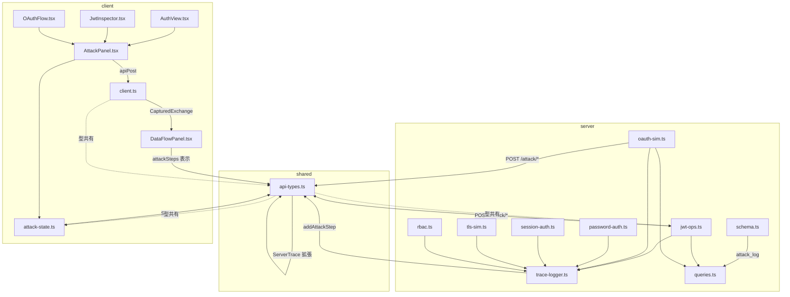

# 01. アーキテクチャ

## 1. 全体構成図

```
┌──────────────────────────────────────────────────────────────────────────┐
│  ブラウザ (SolidJS, port 3000)                                            │
│                                                                            │
│  ┌─────────────────────────────────────────────────────────────────────┐  │
│  │ AuthView  /auth/:subtab                                              │  │
│  │   ├─ ViewModeToggle  ?view=defender|attacker                        │  │
│  │   ├─ [Defender View]  既存タブコンポーネント (JwtInspector 等)      │  │
│  │   └─ [Attacker View]  AttackPanel (新規)                            │  │
│  │        ├─ AttackScenarioSelector                                    │  │
│  │        ├─ AttackStepTimeline                                        │  │
│  │        ├─ AttackResultBanner                                        │  │
│  │        └─ AttackDefensePanel                                    │  │
│  └──────────────────────────┬────────────────────────────────────────┬─┘  │
│                              │ apiPost()                              │    │
│                              │ scope = "attack-<area>"               │    │
│                    DataFlowPanel (HTTP / Trace / Attack タブ)         │    │
└──────────────────────────────┼────────────────────────────────────────────┘
                               │ /api/<area>/attack/<scenario-id>
                               │ (Vite proxy → localhost:3001)
┌──────────────────────────────▼────────────────────────────────────────────┐
│  Hono バックエンド (port 3001)                                             │
│                                                                            │
│  traceMiddleware  (/api/*)                                                 │
│    └─ TraceCollector (addDbQuery / addCryptoOp / addSessionOp             │
│                        addAttackStep  ← 新規拡張)                          │
│                                                                            │
│  ─── 既存ルート (ベース) ──────────────────────────────────────────────   │
│  /api/jwt          → jwtOpsRoutes            (jwt-ops.ts)                 │
│  /api/oauth        → oauthSimRoutes          (oauth-sim.ts)               │
│  /api/auth/password → passwordAuthRoutes     (password-auth.ts)           │
│  /api/session      → sessionAuthRoutes       (session-auth.ts)            │
│  /api/token        → tokenAuthRoutes         (token-auth.ts)              │
│  /api/rbac         → rbacRoutes              (rbac.ts)                    │
│  /api/tls          → tlsSimRoutes            (tls-sim.ts)                 │
│  /api/kerberos     → kerberoSimRoutes        (kerberos-sim.ts)            │
│  /api/oidc         → oidcSamlSimRoutes       (oidc-saml-sim.ts)           │
│  /api/sso          → ssoApikeyRoutes         (sso-apikey.ts)              │
│  /api/mfa          → mfaTotpRoutes           (mfa-totp.ts)                │
│  /api/passkey      → passkeyRoutes           (passkey.ts)                 │
│                                                                            │
│  ─── 攻撃ルート (新規サブパス) ─────────────────────────────────────────  │
│  POST /api/jwt/attack/alg-none                                            │
│  POST /api/jwt/attack/key-confusion                                       │
│  POST /api/oauth/attack/state-csrf                                        │
│  POST /api/oauth/attack/token-leak                                        │
│  POST /api/auth/password/attack/brute-force                               │
│  POST /api/session/attack/fixation                                        │
│  POST /api/tls/attack/downgrade                                           │
│  POST /api/rbac/attack/privilege-escalation                               │
│  ...                                                                       │
│                                                                            │
│  SQLite (better-sqlite3)                                                   │
│    └─ attack_log テーブル (新規)                                           │
└────────────────────────────────────────────────────────────────────────────┘
```

---

## 2. バックエンド設計

### 2.1 ルート配置方針

**採用案: A — 各既存ルートファイルに `/attack/<scenario>` サブパスを追加する**

理由:
- 既存の `jwtOpsRoutes` は `jwt-ops.ts` で管理されており、JWT 関連の攻撃コード (alg:none, key-confusion) も同じファイルに置くことで参照局所性が高まる。
- `server/index.ts` での `app.route("/api/jwt", jwtOpsRoutes)` という登録パターンをそのまま活用できる。
- 既存ルートが持つ定数 (`HS256_SECRET`, `RS256_PRIVATE` 等) を再利用でき、実際の「脆弱な構成」をシミュレーションしやすい。
- 攻撃専用ファイル (`attacks/<area>.ts`) に分割した場合、既存の秘密鍵・クライアント設定・DB アクセスパターンを重複コピーするコストが生じる。

**ルート命名規則**

```
POST /api/<area>/attack/<scenario-id>
```

具体例:

| エリア | scenario-id | 対応ルートファイル |
|--------|-------------|------------------|
| jwt | alg-none | server/routes/jwt-ops.ts |
| jwt | key-confusion | server/routes/jwt-ops.ts |
| oauth | state-csrf | server/routes/oauth-sim.ts |
| oauth | token-leak | server/routes/oauth-sim.ts |
| auth/password | brute-force | server/routes/password-auth.ts |
| session | fixation | server/routes/session-auth.ts |
| session | hijack | server/routes/session-auth.ts |
| tls | downgrade | server/routes/tls-sim.ts |
| tls | cert-spoofing | server/routes/tls-sim.ts |
| rbac | privilege-escalation | server/routes/rbac.ts |
| rbac | idor | server/routes/rbac.ts |
| kerberos | golden-ticket | server/routes/kerberos-sim.ts |
| oidc | pkce-bypass | server/routes/oidc-saml-sim.ts |
| sso | session-puzzling | server/routes/sso-apikey.ts |

### 2.2 ハンドラ責務

各攻撃エンドポイントは以下の順で処理を行う。

```
1. Zod スキーマで入力検証 (parseBody を流用)
2. attack_log に pending レコードを INSERT (scenario_id, started_at)
3. 攻撃シミュレーション本体を実行
   a. 各ステップごとに trace.addAttackStep() を呼び出す
   b. 既存の addCryptoOp / addDbQuery と組み合わせて教育的な可視化を実現
4. 攻撃成立 / 防御ブロック を判定し AttackResult を構築
5. attack_log の対応レコードを UPDATE (success, finished_at, payload_json)
6. c.json({ success: true, data: AttackResult }) を返却
   → traceMiddleware が自動的に _trace を付与
```

**ハンドラのシグネチャ例 (jwt-ops.ts への追加)**

```typescript
// server/routes/jwt-ops.ts
import type { AttackResult, AttackStep } from "../../shared/api-types.js";

jwtOpsRoutes.post("/attack/alg-none", async (c) => {
  const parsed = await parseBody(c, algNoneAttackSchema);
  if ("error" in parsed) return parsed.error;
  const { token } = parsed.data;
  const trace = c.get("trace");

  const steps: AttackStep[] = [];

  // Step 1: intercept — 受信したトークンを表示
  steps.push({ id: "s1", kind: "intercept", label: "Intercept JWT", labelJa: "JWT を傍受", ... });
  trace.addAttackStep(steps[steps.length - 1]);

  // Step 2: tamper — alg を "none" に書き換え、署名を除去
  steps.push({ id: "s2", kind: "tamper", label: "Rewrite alg to none", labelJa: "alg フィールドを none に改竄", ... });
  trace.addAttackStep(steps[steps.length - 1]);

  // Step 3: verify — 脆弱な検証ルーティンが通過するか確認
  const forgedToken = buildAlgNoneToken(token);
  const accepted = verifyWithoutAlgCheck(forgedToken); // 脆弱な実装をシミュレーション
  steps.push({ id: "s3", kind: accepted ? "exploit" : "blocked", ... });
  trace.addAttackStep(steps[steps.length - 1]);

  const result: AttackResult = {
    scenarioId: "alg-none",
    outcome: accepted ? "succeeded" : "blocked",  // "succeeded" | "blocked" | "error" (DESIGN/03 §1.4)
    startedAt: Date.now(),
    finishedAt: Date.now(),
    steps,                                         // steps (observedSteps ではない)
    blockedBy: accepted ? undefined : "algorithm_allowlist",
    summary: "Always explicitly allowlist accepted algorithms.",
    summaryJa: "受け入れるアルゴリズムを明示的に許可リストで指定する。",
  };

  return c.json({ success: true, data: result });
});
```

### 2.3 trace-logger 拡張

`server/middleware/trace-logger.ts` の `TraceCollector` インタフェースと `createTraceCollector()` 関数に `attackSteps` を追加する。

```typescript
// server/middleware/trace-logger.ts への追加分

import type { AttackStep } from "../../shared/api-types.js";

export interface TraceCollector {
  addDbQuery(q: DbQuery): void;
  addCryptoOp(op: CryptoOp): void;
  addSessionOp(op: SessionOp): void;
  /** timestamp は自動付与されるため省略可 (DESIGN/03 §5.1 参照) */
  addAttackStep(step: Omit<AttackStep, "timestamp">): void;   // ← 追加
  getTrace(): ServerTrace;
}
```

`createTraceCollector()` の内部も同様に拡張する:

```typescript
function createTraceCollector(): TraceCollector {
  const dbQueries: DbQuery[] = [];
  const cryptoOps: CryptoOp[] = [];
  const sessionOps: SessionOp[] = [];
  const attackSteps: AttackStep[] = [];    // ← 追加

  return {
    addDbQuery(q) { dbQueries.push(q); },
    addCryptoOp(op) { cryptoOps.push(op); },
    addSessionOp(op) { sessionOps.push(op); },
    addAttackStep(step) { attackSteps.push(step); },  // ← 追加
    getTrace() {
      const trace: ServerTrace = {};
      if (dbQueries.length)  trace.dbQueries  = dbQueries;
      if (cryptoOps.length)  trace.cryptoOps  = cryptoOps;
      if (sessionOps.length) trace.sessionOps = sessionOps;
      if (attackSteps.length) trace.attackSteps = attackSteps;  // ← 追加
      return trace;
    },
  };
}
```

`Hono` の `ContextVariableMap` 宣言は既存のまま (`trace: TraceCollector`) で変更不要。

### 2.4 入力バリデーション (Zod)

攻撃エンドポイント用 Zod スキーマは既存の `server/validation.ts` に追加する。

```typescript
// server/validation.ts への追加分
import { z } from "zod";

export const algNoneAttackSchema = z.object({
  token: z.string().min(10, "token required"),
});

export const stateCsrfAttackSchema = z.object({
  client_id:    z.string().min(1),
  redirect_uri: z.string().url(),
  omitState:    z.boolean().default(true),
});

export const bruteForceAttackSchema = z.object({
  username:  z.string().min(1),
  wordlist:  z.array(z.string()).max(20),  // デモ用上限
});

export const sessionFixationAttackSchema = z.object({
  forcedSessionId: z.string().uuid().optional(),
});
```

---

## 3. フロントエンド設計

### 3.1 コンポーネント階層

```
AuthView  (/auth/:subtab)
├── [既存] ナビゲーション subtab バー  (nav.auth-subtabs)
└── auth-content (role="tabpanel")
    ├── [Defender View]  既存タブコンポーネント (変更最小)
    │   └── ViewModeToggle を末尾に追加するだけ
    └── [Attacker View]  AttackPanel (新規共通シェル)
         ├── AttackScenarioSelector
         │     タブごとの攻撃シナリオ一覧を表示・選択
         │     props: scenarios: AttackScenarioMeta[], onSelect
         ├── AttackStepTimeline
         │     steps を時系列で描画 (D3 or CSS アニメーション)
         │     props: steps: AttackStep[], running: boolean
         ├── AttackResultBanner
         │     success/blocked を大きく表示、CWE/CAPEC リンク付き
         │     props: result: AttackResult | null
         ├── AttackDefensePanel
         │     defenseRecommendation を表示、codeHints をハイライト
         │     props: recommendation: AttackResult["defenseRecommendation"]
         └── DataFlowPanel  scopeId="attack-<tabId>"
               HTTP タブ: 攻撃リクエスト/レスポンス
               Trace タブ: CryptoOp + AttackStep の時系列マージ表示
               DB タブ: attack_log への INSERT/UPDATE を確認
```

### 3.2 コンポーネント配置

```
src/components/auth/
├── AuthView.tsx                     既存 (ViewModeToggle の追加のみ)
├── JwtInspector.tsx                 既存 (ViewModeToggle + AttackPanel 接続のみ)
├── OAuthFlow.tsx                    既存
├── ...                              既存
└── attacks/                         新規ディレクトリ
    ├── AttackPanel.tsx              共通シェル
    ├── ViewModeToggle.tsx           Defender ↔ Attacker 切替ボタン
    ├── AttackScenarioSelector.tsx   シナリオ一覧カード
    ├── AttackStepTimeline.tsx       ステップ可視化
    ├── AttackResultBanner.tsx       結果表示
    ├── AttackDefensePanel.tsx   防御解説
    └── scenarios/                   シナリオ別静的メタデータ
        ├── jwt-scenarios.ts
        ├── oauth-scenarios.ts
        ├── password-scenarios.ts
        ├── session-scenarios.ts
        ├── tls-scenarios.ts
        ├── rbac-scenarios.ts
        └── index.ts                 AuthSubView → AttackScenarioMeta[] マップ
```

### 3.3 既存コンポーネントへの変更方針

既存タブコンポーネント (`JwtInspector.tsx` 等) への変更は最小限に抑える。

変更内容:
1. `ViewModeToggle` を import し、コンポーネント末尾に配置する
2. `viewMode` Signal を `attack-state.ts` から読み取る
3. `<Show when={viewMode() === "attacker"}><AttackPanel tabId="jwt" /></Show>` を追加する

```typescript
// JwtInspector.tsx への追加イメージ
import { viewMode } from "../../state/attack-state";
import ViewModeToggle from "./attacks/ViewModeToggle";
import AttackPanel from "./attacks/AttackPanel";
import { Show } from "solid-js";

// コンポーネント return 内の末尾に追記
<ViewModeToggle />
<Show when={viewMode() === "attacker"}>
  <AttackPanel tabId="jwt" />
</Show>
```

### 3.4 ルーティングと URL 永続化

- 既存 URL 構造: `/auth/:subtab` (useLocation + useNavigate で管理)
- Attacker View の永続化: URL クエリパラメータ `?view=attacker` を使用する
- **`viewMode` は `src/state/attack-state.ts` のグローバル Signal として保持し、`useSearchParams` と双方向同期する** (DESIGN/02 §2.4 の方針を採用)。

```typescript
// src/state/attack-state.ts (実装方針)
import { createSignal } from "solid-js";
import { useSearchParams } from "@solidjs/router";

// viewMode はグローバル Signal として公開し、useSearchParams と双方向同期する
export type ViewMode = "defender" | "attacker";
export const [viewMode, setViewMode] = createSignal<ViewMode>("defender");

// URL ?view=attacker との同期は ViewModeToggle コンポーネント内の createEffect で実施
// グローバル Signal は選択中のシナリオと実行結果も保持
export const [selectedScenario, setSelectedScenario] =
  createSignal<AttackScenarioMeta | null>(null);
export const [currentResult, setCurrentResult] =
  createSignal<AttackResult | null>(null);
export const [attackRunning, setAttackRunning] = createSignal(false);
```

---

## 4. 共有型 (`shared/api-types.ts` に追加)

> **型定義の唯一の真実源は DESIGN/03-data-model.md §1 を参照すること。**
> 本セクションでは型の全定義を重複管理しない。

`shared/api-types.ts` の末尾に DESIGN/03 §1 の定義を実装する:

- `AttackStepKind` — § 1.1 を参照
- `AttackStep` — §1.2 を参照 (`timestamp` は `addAttackStep` で自動付与: `Omit<AttackStep, "timestamp">` を渡す)
- `AttackStepPayload` — §1.3 を参照
- `AttackResult` — §1.4 を参照 (`outcome: "succeeded" | "blocked" | "error"`, `steps: AttackStep[]`)
- `AttackScenarioMeta` — §1.5 を参照 (`tabId: AuthSubView`, `osiLayer: number | string`, `severity: "info" | "low" | "medium" | "high" | "critical"`)
- `AttackLogRow` — §2.1 を参照
- `ServerTrace` 拡張 — §1.6 を参照 (`attackSteps?: AttackStep[]`)

### 4.1 tabId と area プレフィックスのマッピング

| tabId | route file | area prefix |
|-------|-----------|-------------|
| `auth-methods` | password-auth.ts | /api/auth/password |
| `jwt` | jwt-ops.ts | /api/jwt |
| `oauth` | oauth-sim.ts | /api/oauth |
| `session-vs-token` | session-auth.ts, token-auth.ts | /api/session, /api/token |
| `rbac` | rbac.ts | /api/rbac |
| `fido2` | webauthn.ts | /api/webauthn |
| `oidc-saml` | oidc-saml-sim.ts | /api/oidc, /api/saml |
| `kerberos` | kerberos-sim.ts | /api/kerberos |
| `tls-deep` | tls-sim.ts | /api/tls |
| `sso-idp-apikey` | sso-apikey.ts | /api/sso |
| `mfa` | mfa-totp.ts | /api/mfa |
| `passkey` | passkey.ts | /api/passkey |

---

## 5. ServerTrace 拡張の詳細

### 5.1 DataFlowPanel での表示統合

`src/components/shared/DataFlowPanel.tsx` の `TraceView` コンポーネント (現在 `cryptoOps` と `sessionOps` を表示) に、`attackSteps` の表示セクションを追加する。

表示方針:
- "Attack Steps" セクションを Trace タブの先頭に配置する (最重要情報のため)
- `AttackStepKind` ごとに異なる色とアイコンで表示する
- `status: "blocked"` は緑色で「防御成功」を強調する
- `status: "exploit"` は赤色でアラート表示する

```
Trace タブ内のレイアウト:
┌─────────────────────────────────────────┐
│ [⚔] Attack Steps (攻撃ステップ)          │
│   s1  intercept  JWT を傍受      running │
│   s2  tamper     alg を none に改竄 ✓   │
│   s3  exploit    署名なしで認証成功 ⚠    │
├─────────────────────────────────────────┤
│ [🔐] Crypto Operations                  │
│   ...                                   │
├─────────────────────────────────────────┤
│ [📋] Session Operations                 │
│   ...                                   │
└─────────────────────────────────────────┘
```

### 5.2 時系列マージ

`timestamp` フィールドを使用して、`attackSteps` / `cryptoOps` / `dbQueries` を単一タイムラインにマージして表示することも可能にする。この実装は `DataFlowPanel.tsx` の `TraceView` にオプション機能として追加する。

---

## 6. 状態管理

### 6.1 新規ファイル: `src/state/attack-state.ts`

既存の `security-state.ts` は Security View (View 6) 専用のため流用しない (責務分離)。

```typescript
// src/state/attack-state.ts
import { createSignal } from "solid-js";
import type { AttackScenarioMeta, AttackResult } from "../../shared/api-types";

/**
 * 攻撃デモカタログのグローバル Signal
 *
 * viewMode は URL クエリパラメータ (?view=attacker) と同期するため、
 * コンポーネント側で useSearchParams を使って管理する。
 * このファイルには「選択中のシナリオ」と「最新の結果」のみ保持する。
 */

/** 現在選択中の攻撃シナリオ (null = 未選択) */
export const [selectedScenario, setSelectedScenario] =
  createSignal<AttackScenarioMeta | null>(null);

/** 直近の攻撃実行結果 (null = 未実行) */
export const [currentResult, setCurrentResult] =
  createSignal<AttackResult | null>(null);

/** 攻撃実行中フラグ */
export const [attackRunning, setAttackRunning] = createSignal(false);

/** 攻撃結果をリセットする */
export function resetAttackState() {
  setSelectedScenario(null);
  setCurrentResult(null);
  setAttackRunning(false);
}
```

### 6.2 既存状態との依存関係

| 既存 Signal | 利用可否 | 理由 |
|-------------|---------|------|
| `app-state.ts` の `selectedLayer` | 利用可 | OSI 層ハイライト連携に使える |
| `security-state.ts` の `selectedAttackLayer` | 利用しない | Security View (View 6) 専用 |
| `security-state.ts` の `jwtActiveSection` | 利用しない | JwtInspector 内の Defender View 専用 |

---

## 7. API クライアント

### 7.1 既存パターンをそのまま流用

`src/api/client.ts` の `apiPost<T>` は変更不要。`AttackResult` は `_trace` 付きで返却される。

```typescript
// AttackPanel.tsx 内での呼び出しパターン
import { apiPost } from "../../../api/client";
import type { AttackResult } from "../../../../shared/api-types";

const SCOPE = `attack-${props.tabId}`;  // e.g. "attack-jwt"

async function runAttack(scenario: AttackScenarioMeta, params: unknown) {
  setAttackRunning(true);
  const res = await apiPost<AttackResult>(scenario.apiPath, params, SCOPE);
  if (res.data) {
    setCurrentResult(res.data);
  }
  setAttackRunning(false);
}
```

`DataFlowPanel scopeId={SCOPE}` を `AttackPanel` 内に配置するだけで、HTTP / Trace / DB の表示が自動的に機能する。

### 7.2 型安全性の確保

`AttackResult` は `ApiResponse<AttackResult>` 経由で返却されるため、`res.data` は `AttackResult | undefined` 型になる。`<Show when={currentResult()}>` で null チェックを行う。

---

## 8. DB スキーマ追加 (詳細は 03-data-model.md)

### 8.1 attack_log テーブル

> **attack_log テーブルの DDL・インデックス・TypeScript 行型の唯一の真実源は → DESIGN/03 §2.1 を参照すること。**
> 本セクションでは DDL を重複管理しない。

### 8.2 schema.ts への組み込み

`server/db/schema.ts` の `initSchema()` 関数内の `db.exec(...)` に上記 DDL を追加する。`seedDb()` でのリセット時は `DELETE FROM attack_log` を追加する。`ALLOWED_TABLES` (`server/index.ts`) に `"attack_log"` を追加し、デバッグエンドポイントで閲覧可能にする。

### 8.3 DB ユーティリティ

```typescript
// server/db/queries.ts への追加
import type { AttackLogRow } from "../../shared/api-types.js";

export function insertAttackLog(
  db: Database.Database,
  scenarioId: string
): number {
  const stmt = db.prepare(
    "INSERT INTO attack_log (scenario_id) VALUES (?)"
  );
  return Number(stmt.run(scenarioId).lastInsertRowid);
}

export function finalizeAttackLog(
  db: Database.Database,
  id: number,
  success: boolean,
  payloadJson: string
): void {
  db.prepare(
    `UPDATE attack_log
     SET success = ?, finished_at = datetime('now'), payload_json = ?
     WHERE id = ?`
  ).run(success ? 1 : 0, payloadJson, id);
}
```

---

## 9. 依存関係図



### 9.1 テキスト形式の依存サマリー

```
shared/api-types.ts
  ← server/middleware/trace-logger.ts  (TraceCollector 拡張)
  ← server/routes/*.ts                 (AttackResult 返却)
  ← server/db/queries.ts               (AttackLogRow INSERT/UPDATE)
  ← src/api/client.ts                  (ServerTrace 型インポート)
  ← src/state/attack-state.ts          (AttackScenarioMeta, AttackResult)
  ← src/components/auth/attacks/*.tsx  (全攻撃コンポーネント)
  ← src/components/shared/DataFlowPanel.tsx (AttackStep 表示)

src/state/attack-state.ts
  ← src/components/auth/attacks/AttackPanel.tsx
  ← src/components/auth/attacks/ViewModeToggle.tsx

src/api/client.ts  (変更なし)
  ← src/components/auth/attacks/AttackPanel.tsx
```

---

## 10. 関連ファイル

### 10.1 既存ファイル (変更対象)

| ファイルパス | 変更内容 | 変更規模 |
|-------------|---------|---------|
| `shared/api-types.ts` | `AttackStep`, `AttackResult`, `AttackScenarioMeta`, `AttackLogRow` 型を追加。`ServerTrace` に `attackSteps?: AttackStep[]` を追加 | 小 (~80 行追加) |
| `server/middleware/trace-logger.ts` | `TraceCollector` に `addAttackStep()` を追加。`createTraceCollector()` 内部に `attackSteps[]` を追加 | 極小 (~12 行変更) |
| `server/routes/jwt-ops.ts` | `POST /attack/alg-none`, `POST /attack/key-confusion` を追加 | 中 (~100 行追加) |
| `server/routes/oauth-sim.ts` | `POST /attack/state-csrf`, `POST /attack/token-leak` を追加 | 中 (~100 行追加) |
| `server/routes/password-auth.ts` | `POST /attack/brute-force` を追加 | 小 (~60 行追加) |
| `server/routes/session-auth.ts` | `POST /attack/fixation`, `POST /attack/hijack` を追加 | 中 (~100 行追加) |
| `server/routes/tls-sim.ts` | `POST /attack/downgrade`, `POST /attack/cert-spoofing` を追加 | 中 (~100 行追加) |
| `server/routes/rbac.ts` | `POST /attack/privilege-escalation`, `POST /attack/idor` を追加 | 中 (~100 行追加) |
| `server/routes/kerberos-sim.ts` | `POST /attack/golden-ticket` を追加 | 中 (~80 行追加) |
| `server/routes/oidc-saml-sim.ts` | `POST /attack/pkce-bypass` を追加 | 小 (~60 行追加) |
| `server/routes/sso-apikey.ts` | `POST /attack/session-puzzling` を追加 | 小 (~60 行追加) |
| `server/db/schema.ts` | `attack_log` テーブル DDL を `initSchema()` に追加。`seedDb()` にリセット処理を追加 | 極小 (~20 行追加) |
| `server/db/queries.ts` | `insertAttackLog()`, `finalizeAttackLog()` を追加 | 小 (~30 行追加) |
| `server/index.ts` | `ALLOWED_TABLES` に `"attack_log"` を追加。`TABLE_QUERIES` にクエリを追加 | 極小 (~5 行変更) |
| `src/components/shared/DataFlowPanel.tsx` | `TraceView` に `attackSteps` セクションを追加 | 小 (~60 行追加) |
| `src/components/auth/JwtInspector.tsx` | `ViewModeToggle` + `AttackPanel` の条件表示を追加 | 極小 (~10 行追加) |
| `src/components/auth/OAuthFlow.tsx` | 同上 | 極小 |
| `src/components/auth/AuthComparison.tsx` | 同上 | 極小 |
| `src/components/auth/PermissionModel.tsx` | 同上 | 極小 |
| `src/components/auth/TlsDeepDive.tsx` | 同上 | 極小 |
| `src/components/auth/KerberosFlow.tsx` | 同上 | 極小 |
| `src/components/auth/OidcSamlFlow.tsx` | 同上 | 極小 |
| `src/components/auth/SsoPatterns.tsx` | 同上 | 極小 |

### 10.2 新規ファイル (作成対象)

| ファイルパス | 内容 |
|-------------|------|
| `src/state/attack-state.ts` | `selectedScenario`, `currentResult`, `attackRunning` の各 Signal |
| `src/components/auth/attacks/AttackPanel.tsx` | 共通シェル。`AttackScenarioSelector` 等を束ねる |
| `src/components/shared/EducationalWarningBanner.tsx` | 赤帯教育警告バナー (Attacker View 常時表示、dismissable 禁止) |
| `src/components/auth/attacks/ViewModeToggle.tsx` | Defender / Attacker 切替ボタン (`useSearchParams` 連携) |
| `src/components/auth/attacks/AttackScenarioSelector.tsx` | シナリオカード一覧 (`AttackScenarioMeta[]` を受け取る) |
| `src/components/auth/attacks/AttackStepTimeline.tsx` | `AttackStep[]` をアニメーション付きで描画 |
| `src/components/auth/attacks/AttackResultBanner.tsx` | 攻撃成立 / 防御阻止 を大きく表示 |
| `src/components/auth/attacks/AttackDefensePanel.tsx` | 防御策と `codeHints` を表示 |
| `src/components/auth/attacks/AttackPanel.css` | 攻撃デモ UI のスタイル (PCB テーマ準拠) |
| `src/components/auth/attacks/scenarios/jwt-scenarios.ts` | JWT タブ用 `AttackScenarioMeta[]` |
| `src/components/auth/attacks/scenarios/oauth-scenarios.ts` | OAuth タブ用 |
| `src/components/auth/attacks/scenarios/password-scenarios.ts` | パスワード認証タブ用 |
| `src/components/auth/attacks/scenarios/session-scenarios.ts` | Session/Token タブ用 |
| `src/components/auth/attacks/scenarios/tls-scenarios.ts` | TLS タブ用 |
| `src/components/auth/attacks/scenarios/rbac-scenarios.ts` | RBAC タブ用 |
| `src/components/auth/attacks/scenarios/kerberos-scenarios.ts` | Kerberos タブ用 |
| `src/components/auth/attacks/scenarios/oidc-scenarios.ts` | OIDC タブ用 |
| `src/components/auth/attacks/scenarios/sso-scenarios.ts` | SSO タブ用 |
| `src/components/auth/attacks/scenarios/index.ts` | `AuthSubView → AttackScenarioMeta[]` マップ |

### 10.3 DESIGN ファイル (今後作成予定)

| ファイルパス | 内容 |
|-------------|------|
| `DESIGN/02-scenarios.md` | 全シナリオの詳細仕様 (攻撃手順、期待結果、OSI 層マッピング) |
| `DESIGN/03-data-model.md` | `attack_log` テーブル詳細設計、クエリパターン |
| `DESIGN/04-ui-spec.md` | コンポーネントのプロパティ仕様、CSS 変数、アニメーション設計 |

---

## 11. 実装上の注意事項

### 11.1 SolidJS ルール遵守

- `AttackPanel.tsx` 等の新規コンポーネントでも props デストラクチャリングは禁止 (`props.tabId` でアクセスする)
- `attackRunning` の状態に応じた表示切替は `<Show when={attackRunning()}>` を使用する
- `AttackStepTimeline.tsx` でのステップリストは `<For each={steps()}>` を使用する
- コンポーネント関数は 1 度しか実行されないため、D3 アニメーションは `createEffect` 内で `attackRunning` や `currentResult` を監視してトリガーする

### 11.2 教育的配慮

- 攻撃シミュレーションはすべて教育用の簡略化実装とし、実際のエクスプロイトコードは含めない
- `AttackResultBanner` で「このデモは学習目的のシミュレーションです」を常時表示する
- 攻撃成立時も `defenseRecommendation` を必ず表示し、「防御方法を理解する」ことを主目的とする

### 11.3 セキュリティ境界

- 攻撃エンドポイントは `process.env.NODE_ENV === "production"` 時に 403 を返すガードを追加する
- `attack_log` には個人を特定できる情報を記録しない (デモユーザー ID のみ)

### 11.4 i18n

- 全ラベル・説明文は `t(ja, en)` ヘルパーでバイリンガル対応する
- `AttackScenarioMeta` の `nameJa`, `descriptionJa`, `prerequisitesJa`, `defensesJa` フィールドで静的データを管理する
- `AttackStep` の `labelJa`, `detailJa` フィールドでサーバー側の動的メッセージを管理する
